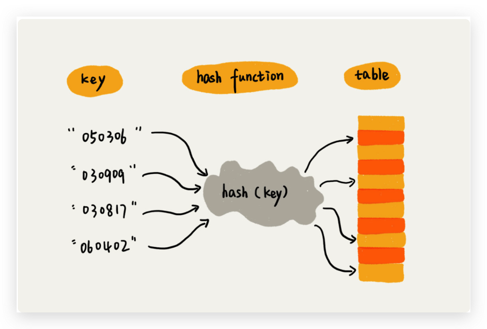
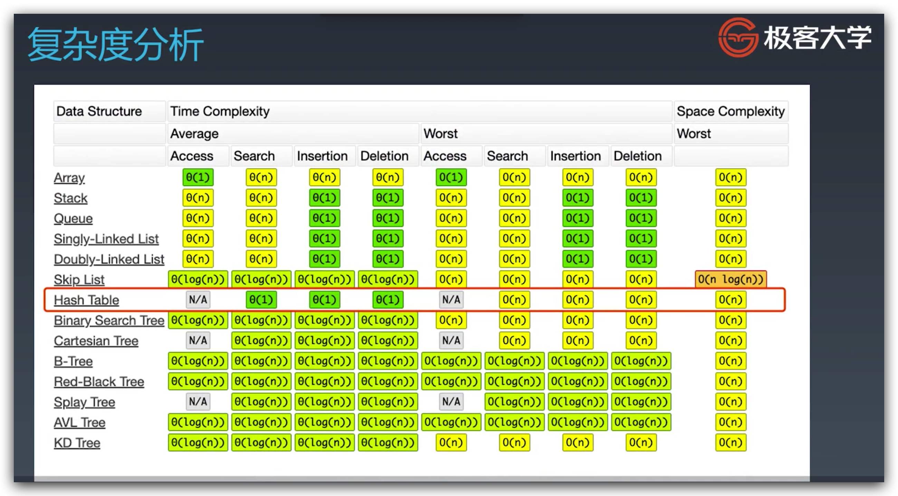
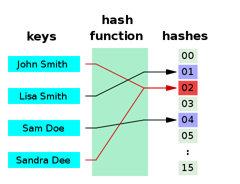
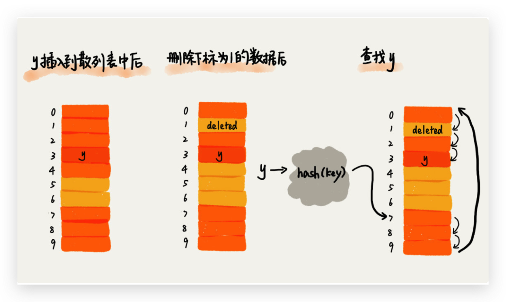
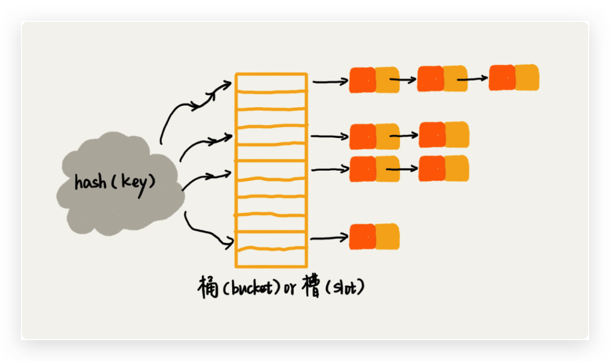

# 学习笔记

## 哈希表 Hash Table

### 定义

哈希表也叫散列表、Hash 表，是根据关键码值（Key value）直接进行访问的数据结构。将 key 映射为数组下标的的函数，叫做散列函数（Hash Function），记为 `hash(key)`。

> 散列表用的是数组支持按照下标随机访问数据的特性，所以散列表其实就是数组的一种扩展，由数组演化而来。可以说，如果没有数组，就没有散列表。



### 散列函数的设计要求

    1. 散列值是一个非负整数。
    2. 如果 `key1 = key2`，那么 `hash(key1) == hash(key2)`。
    3. 如果 `key1 != key2`，那么 `hash(key1) != hash(key2)`。

> 首先，散列函数的设计不能太复杂。过于复杂的散列函数，势必会消耗很多计算时间，也就间接的影响到散列表的性能。
> 其次，散列函数生成的值要尽可能随机并且均匀分布，这样才能避免或者最小化散列冲突，而且即便出现冲突，散列到每个槽里的数据也会比较平均，不会出现某个槽内数据特别多的情况。

简单的说就是：简单 + 均匀。

### 常见的哈希算法

* [MD5](https://zh.wikipedia.org/wiki/MD5)
* [SHA家族](https://zh.wikipedia.org/wiki/SHA%E5%AE%B6%E6%97%8F)
* [循環冗餘校驗](https://zh.wikipedia.org/wiki/%E5%BE%AA%E7%92%B0%E5%86%97%E9%A4%98%E6%A0%A1%E9%A9%97)

### 时间复杂度



添加、删除和查询都是 O(1)，散列冲突的极限情况退化为 O(n)，树化可能退化为 O(log n)。

### 散列冲突 Collision

如果不同的输入得到了同一个哈希值，就发生了"哈希碰撞"（collision）。



通过 [鴿巢原理](https://zh.wikipedia.org/wiki/%E9%B4%BF%E5%B7%A2%E5%8E%9F%E7%90%86) 可知，散列冲突不可避免，常见的解决散列冲突的方法有两种，开放寻址法（Open Addressing）和链表法（Chaining）。

#### 开放寻址法

当遇到散列冲突时，寻找其他未被占用的位置，具体探测方法包括：

    1. 线性探测（Linear Probing）：冲突后依次往后找空闲位置。删除时不可直接删除，而是做删除标记，查找到碰到删除标记后要跳过继续查找，否则以后探测到这个位置，其后面就会探测不到导致算法失效。极端情况时间复杂度退化到 O(n)。
    2. 二次探测（Quadratic Probing）：探测步长变为原来的二次方。
    3. 双重散列（Double Hashing）：使用一组散列函数，冲突时更换散列函数寻找空闲位置。



JDK 中 ThreadLocalMap 就是采用的开放寻址法解决散列冲突。

#### 链表法

对于冲突的 key，使用链表的数据结构来存储。查找的时间复杂度跟链表长度 k 成正比，即 O(k)。所以要求散列函数的结果均匀，否则极端情况就退化成了链表。JDK 的 HashMap 中，链表长度大于 8 还会树化为红黑树，进一步进行性能优化 O(log n)。



JDK 中 HashMap 采用了链表法解决动态扩容。

#### 🤔 开放寻址法 VS 链表法，各有什么优势和劣势

> **链表法比起开放寻址法，对大装载因子的容忍度更高。**开放寻址法只能适用装载因子小于 1 的情况。接近 1 时，就可能会有大量的散列冲突，导致大量的探测、再散列等，性能会下降很多。但是对于链表法来说，只要散列函数的值随机均匀，即便装载因子变成 10，也就是链表的长度变长了而已，虽然查找效率有所下降，但是比起顺序查找还是快很多。

对象大、数据量大的情况，链表法更好更灵活，还可以优化为红黑树等等。

> 链表因为要存储指针，所以对于比较小的对象的存储，是比较消耗内存的，还有可能会让内存的消耗翻倍。而且，因为链表中的结点是零散分布在内存中的，不是连续的，所以对 CPU 缓存是不友好的，这方面对于执行效率也有一定的影响。

链表法更加消耗内存和 CPU 资源。对于小对象及小数据量存储场景，更适合用开放寻址法。

### 装载因子（负载因子） Load Factor

表示空位的多少的参数，其计算公式为：`装载因子 = 填入表中元素个数 / 散列表长度`

**装载因子不能太大，否则空闲位置过少，冲突越多，性能下降越多，空间利用率低。**

#### 🤔 如果装载因子过大，怎么办

动态扩容。

> 重新申请一个更大的散列表，将数据搬移到这个新散列表中。假设每次扩容我们都申请一个原来散列表大小两倍的空间。如果原来散列表的装载因子是 0.8，那经过扩容之后，新散列表的装载因子就下降为原来的一半，变成了 0.4。
> 装载因子阈值的设置要权衡时间、空间复杂度。
> 如果内存空间不紧张，对执行效率要求很高，可以降低负载因子的阈值；
> 相反，如果内存空间紧张，对执行效率要求又不高，可以增加负载因子的值，甚至可以大于 1。

### 扩容 Resize

`threshold = capacity * loadFactor`

一旦 map 中键值对数量达到了 threshold，则会触发 resize 进行扩容，扩容如果导致 hash 结果变化，还需要 rehash。这里 JDK1.7 和 JDK1.8 的是实现有区别。

#### 🤔 如何避低效扩容

> 1. 当有新数据要插入时，我们将新数据插入新散列表中，并且从老的散列表中拿出一个数据放入到新散列表。每次插入一个数据到散列表，我们都重复上面的过程。经过多次插入操作之后，老的散列表中的数据就一点一点全部搬移到新散列表中了。这样没有了集中的一次性数据搬移，插入操作就都变得很快了。
> 2. 这期间的查询操作怎么来做呢？对于查询操作，为了兼容了新、老散列表中的数据，我们先从新散列表中查找，如果没有找到，再去老的散列表中查找。

### 散列表的应用

* Work 文档中的单词拼写检查，常用英文单词 20 万个，假设平均长度是 10 个字母，占用 10 个字节，20 万单词占用 2MB 空间，可以满足现代计算机内存空间占用。

#### 🤔 何为一个工业级的散列表？工业级的散列表应该具有哪些特性

* 支持快速的查询、插入、删除操作。
* 内存占用合理，不能浪费过多的内存空间。
* 性能稳定，极端情况下，散列表的性能也不会退化到无法接受的情况。

#### 🤔 如何实现这样一个散列表呢

* 设计一个合适的散列函数。
* 定义装载因子阈值，并且设计动态扩容策略。
* 选择合适的散列冲突解决方法。

### 🤔 思考题

* 假设我们有 10 万条 URL 访问日志，如何按照访问次数给 URL 排序？
A：以 URL 为 key，访问次数为 value，存储于散列表中，然后通过排序算法根据 value 排序。存储 O(n)，排序 O(log n)。

* 有两个字符串数组，每个数组大约有 10 万条字符串，如何快速找出两个数组中相同的字符串？
A：遍历较长的数组，存于散列表。第二次遍历另一数组，然后判断是否包含在散列表中。两次遍历 O(m + n)。

### Reference

* [哈希碰撞与生日攻击 - 阮一峰的网络日志](http://www.ruanyifeng.com/blog/2018/09/hash-collision-and-birthday-attack.html)
* [18 | 散列表（上）：Word文档中的单词拼写检查功能是如何实现的？-极客时间](https://time.geekbang.org/column/article/64233)
* [19 | 散列表（中）：如何打造一个工业级水平的散列表？-极客时间](https://time.geekbang.org/column/article/64586)
* [20 | 散列表（下）：为什么散列表和链表经常会一起使用？-极客时间](https://time.geekbang.org/column/article/64858)
* [生日攻击 - 维基百科，自由的百科全书](https://zh.wikipedia.org/zh-hans/%E7%94%9F%E6%97%A5%E6%94%BB%E5%87%BB)

# JDK HashMap 源码分析

## put

put 方法调用了 putVal 方法，第一个参数对 key 应用了散列函数。

```java
public V put(K key, V value) {
    return putVal(hash(key), key, value, false, true);
}
```

在散列函数内可以看到 key 不为空时的计算逻辑，key 的 hashCode 与其自己右移后的高 16 位进行位异或操作。

## 散列函数

从散列函数的注释中可以看到，这么做是为了将高位的差异影响传播到低位。

> Because the table uses power-of-two masking, sets of hashes that vary only in bits above the current mask will always collide.  

因为表使用 2 的次幂，所以对于只有高位变化的哈希值，将总是冲突。

int 型的 hashCode 32 位，右移 16 位后高 16 位补 0，异或后的结果，高 16 位保持不变，低 16 位则会受到高位影响而变化。

```java
/**
 * Computes key.hashCode() and spreads (XORs) higher bits of hash
 * to lower. Because the table uses power-of-two masking, sets of
 * hashes that vary only in bits above the current mask will
 * always collide. (Among known examples are sets of Float keys
 * holding consecutive whole numbers in small tables.)  So we
 * apply a transform that spreads the impact of higher bits
 * downward. There is a tradeoff between speed, utility, and
 * quality of bit-spreading. Because many common sets of hashes
 * are already reasonably distributed (so don't benefit from
 * spreading), and because we use trees to handle large sets of
 * collisions in bins, we just XOR some shifted bits in the
 * cheapest possible way to reduce systematic lossage, as well as
 * to incorporate impact of the highest bits that would otherwise
 * never be used in index calculations because of table bounds.
 */
static final int hash(Object key) {
    int h;
    return (key == null) ? 0 : (h = key.hashCode()) ^ (h >>> 16);
}
```

### 🤔 散列函数使用 key 的 hashCode 与 table 的长度求余取模，有什么不好？为什么要用高低十六位做异或

求模：`index = key.hashCode() % table.length()` 或 `index = key.hashCode() & (table.lengh() - 1)`。

hashCode 返回类型为 int，占 4 字节 32 位。由于确定哈希表中桶的位置使用的是求模运算，所以数组长度在较小时，只能反应出 hashCode 中低位的变化，很容易散列冲突。右移十六位做异或就弥补了这个缺点，对高位的变化，也能提现出来，减小了散列冲突的概率。

## putVal

基本逻辑：

   1. 先建哈希表数组。
   2. 在数组位置建链表的头结点。
   3. 如果有散列冲突，顺着链表往后插入节点。
   4. 碰到相同 key 的，最后决定是否覆盖其值。
   5. 链表长度大于等于 8 时树化，树化后再添加节点就是用插入树节点的方法。

```java
/**
 * Implements Map.put and related methods.
 *
 * @param hash hash for key
 * @param key the key
 * @param value the value to put
 * @param onlyIfAbsent if true, don't change existing value
 * @param evict if false, the table is in creation mode.
 * @return previous value, or null if none
 */
final V putVal(int hash, K key, V value, boolean onlyIfAbsent,
               boolean evict) {
    Node<K,V>[] tab; Node<K,V> p; int n, i;
    // 哈希表为空就新建哈希表数组
    if ((tab = table) == null || (n = tab.length) == 0)
        n = (tab = resize()).length;
    // 对长度取模算出数组下标，此位置空着就新建节点
    if ((p = tab[i = (n - 1) & hash]) == null)
        tab[i] = newNode(hash, key, value, null);
    // 节点不空
    else {
        Node<K,V> e; K k;
        // hash 相同并且 key 相同，说明已存在，把节点赋值给 e，后面再决定是否覆盖值。
        if (p.hash == hash &&
            ((k = p.key) == key || (key != null && key.equals(k))))
            e = p;
        // p 是树节点，调用 TreeNode#putTreeVal 添加树节点
        else if (p instanceof TreeNode)
            e = ((TreeNode<K,V>)p).putTreeVal(this, tab, hash, key, value);
        // 正常添加节点
        else {
            for (int binCount = 0; ; ++binCount) {
                // 如果下一节点为空就添加新节点
                if ((e = p.next) == null) {
                    p.next = newNode(hash, key, value, null);
                    // 树化阈值 TREEIFY_THRESHOLD = 8，这里 binCount 从 0 开始计数
                    // 但由于没有算头结点，所以节点数其实是大于等于 8，会进行树化
                    // 头结点后面的节点，被形容为 bin
                    if (binCount >= TREEIFY_THRESHOLD - 1) // -1 for 1st
                        treeifyBin(tab, hash);
                    break;
                }
                // key 已存在直接跳出循环，后续决定是否覆盖值
                if (e.hash == hash &&
                    ((k = e.key) == key || (key != null && key.equals(k))))
                    break;
                // 不冲突的情况往链表后面走
                p = e;
            }
        }
        // e 为已存在的节点，根据 onlyIfAbsent 决定是否覆盖
        if (e != null) { // existing mapping for key
            V oldValue = e.value;
            if (!onlyIfAbsent || oldValue == null)
                e.value = value;
            // 钩子，预留给 LinkedHashMap 的访问后处理方法
            afterNodeAccess(e);
            // 不累加操作次数，也不会调用插入后处理的钩子方法，直接返回
            return oldValue;
        }
    }
    // 累加操作次数
    ++modCount;
    // 长度超过阈值就进行扩容
    if (++size > threshold)
        resize();
    // 钩子，预留给 LinkedHashMap 的插入后处理方法
    afterNodeInsertion(evict);
    return null;
}
```

看一下链表的节点 Node 结构，除了 key、value、next 之外，还有 hash。

```java
static class Node<K,V> implements Map.Entry<K,V> {
    final int hash;
    final K key;
    V value;
    Node<K,V> next;

    Node(int hash, K key, V value, Node<K,V> next) {
        this.hash = hash;
        this.key = key;
        this.value = value;
        this.next = next;
    }

    ......
}
```

## resize

再看扩容方法，有两个功能，一个是扩容，另一个是初始化。

先贴一下阈值计算公式：`threshold = capacity * loadFactor`。

扩容由于要遍历数组及链表，时间复杂度 O(n^2)。

基本逻辑：
    1. 如已有数据，容量和阈值翻倍 ，否则初始化容量和阈值。
    2. 创建新的哈希表数组，遍历原哈希表，将原来链表中的元素放到新哈希表中原数组及新增数组的两个链表中。

```java
/**
 * Initializes or doubles table size.  If null, allocates in
 * accord with initial capacity target held in field threshold.
 * Otherwise, because we are using power-of-two expansion, the
 * elements from each bin must either stay at same index, or move
 * with a power of two offset in the new table.
 *
 * @return the table
 */
final Node<K,V>[] resize() {
    Node<K,V>[] oldTab = table;
    int oldCap = (oldTab == null) ? 0 : oldTab.length;
    int oldThr = threshold;
    int newCap, newThr = 0;
    if (oldCap > 0) {
        // 检查容量上限，最大只能到整数最大值
        if (oldCap >= MAXIMUM_CAPACITY) {
            threshold = Integer.MAX_VALUE;
            return oldTab;
        }
        // 新容量和新阈值扩容为原容量和原阈值的两倍
        else if ((newCap = oldCap << 1) < MAXIMUM_CAPACITY &&
                 oldCap >= DEFAULT_INITIAL_CAPACITY)
            newThr = oldThr << 1; // double threshold
    }
    // 已初始化过阈值，比如通过带参数构造方法新建
    else if (oldThr > 0) // initial capacity was placed in threshold
        newCap = oldThr;
    // 初始化阈值，默认容量 16，阈值为 16 * 0.75f
    else {               // zero initial threshold signifies using defaults
        newCap = DEFAULT_INITIAL_CAPACITY;
        newThr = (int)(DEFAULT_LOAD_FACTOR * DEFAULT_INITIAL_CAPACITY);
    }
    if (newThr == 0) {
        float ft = (float)newCap * loadFactor;
        newThr = (newCap < MAXIMUM_CAPACITY && ft < (float)MAXIMUM_CAPACITY ?
                  (int)ft : Integer.MAX_VALUE);
    }
    // 创建新哈希表
    threshold = newThr;
    @SuppressWarnings({"rawtypes","unchecked"})
    Node<K,V>[] newTab = (Node<K,V>[])new Node[newCap];
    table = newTab;
    if (oldTab != null) {
        // 遍历哈希表
        for (int j = 0; j < oldCap; ++j) {
            Node<K,V> e;
            if ((e = oldTab[j]) != null) {
                // 把数组中每个链表头结点清空
                oldTab[j] = null;
                // 头结点后面没有节点时，把元素放入扩容后出计算出来的下标位置上
                if (e.next == null)
                    newTab[e.hash & (newCap - 1)] = e;
                // 头结点是树节点，调用 TreeNode#split 处理
                else if (e instanceof TreeNode)
                    ((TreeNode<K,V>)e).split(this, newTab, j, oldCap);
               // 头结点后面有元素的情况
                else { // preserve order
                    // 原链表头节点和尾节点
                    Node<K,V> loHead = null, loTail = null;
                    // 新链表头节点和尾节点
                    Node<K,V> hiHead = null, hiTail = null;
                    Node<K,V> next;
                    // 遍历链表
                    do {
                        next = e.next;
                        // 通过节点哈希与原容量做位与
                        // 判断结果是否等于 0，来区分节点在新数组中的原数组部分还是新增数组部分
                        // 这就把原链表拆分放入新哈希表的两个桶中了，而位置原 index 和 oldCap + index
                        if ((e.hash & oldCap) == 0) {
                            if (loTail == null)
                                loHead = e;
                            else
                                loTail.next = e;
                            loTail = e;
                        }
                        else {
                            if (hiTail == null)
                                hiHead = e;
                            else
                                hiTail.next = e;
                            hiTail = e;
                        }
                    } while ((e = next) != null);
                    // 原链表尾指向空，头放到哈希表中
                    if (loTail != null) {
                        loTail.next = null;
                        newTab[j] = loHead;
                    }
                    // 新链表尾指向空，头放到哈希表中
                    if (hiTail != null) {
                        hiTail.next = null;
                        newTab[j + oldCap] = hiHead;
                    }
                }
            }
        }
    }
    return newTab;
}
```

### 🤔 判断元素放入新表的高位桶还是低位桶，是以什么条件来判断的？为什么这样判断

判断条件：`(e.hash & oldCap) == 0`。通过对 oldCap 做位与操作，可以将原来链表中的元素均匀（如果原来的值是连续的）的分配到高、低通相同位置的索引中，即原 index 和 index + oldCap 位置。链表中任意两个连续元素，相差 oldCap，这就使 hashCode 的二进制表示中，oldCap 那一位会出现交替为 1 的情况，而 capacity 被设计为 2 的幂次，有且仅有一位为 1。这样位与后判断是否为 0，就可以是连续的链表元素分别落到不同的桶中。同时，由于有一半 index 并没有变化，避免了移动。

## get

调用的核心方法是 getNode。

```java
public V get(Object key) {
    Node<K,V> e;
    return (e = getNode(hash(key), key)) == null ? null : e.value;
}
```

## getNode

比较简单，就是求模确定数组索引位置，然后遍历链表或者树。

```java
/**
 * Implements Map.get and related methods.
 *
 * @param hash hash for key
 * @param key the key
 * @return the node, or null if none
 */
final Node<K,V> getNode(int hash, Object key) {
    Node<K,V>[] tab; Node<K,V> first, e; int n; K k;
    if ((tab = table) != null && (n = tab.length) > 0 &&
        (first = tab[(n - 1) & hash]) != null) {
        // 检查头节点
        if (first.hash == hash && // always check first node
            ((k = first.key) == key || (key != null && key.equals(k))))
            return first;
        // 检查后续节点
        if ((e = first.next) != null) {
            // 树节点调用 TreeNode#getTreeNode 方法处理
            if (first instanceof TreeNode)
                return ((TreeNode<K,V>)first).getTreeNode(hash, key);
            // 向后遍历
            do {
                if (e.hash == hash &&
                    ((k = e.key) == key || (key != null && key.equals(k))))
                    return e;
            } while ((e = e.next) != null);
        }
    }
    return null;
}
```

# 树 Tree

## 概念

* 节点高度（Height）：节点到叶子节点的最长路径（边数）。
* 深度（Depth）：根节点到这个节点所经历的边数。
* 层数（Level）：节点深度 + 1。
* 树的高度：根节点高度。
    
## 二叉树 Binary Tree

* 第 i 层最多有 `2^(i - 1)` 个节点；
* 深度为 k 的二叉树最多总共可以有 `2^(k+1)-1` 个节点（定义根节点深度为 0）；
* 拥有最大节点数的二叉树成为满二叉树（Full Binary Tree）；
* 除最后一层以外为满二叉树，且最后一层所有叶子节点都靠左排列的二叉树成为完全二叉树（Complete Binary Tree）；
* 深度为 k 的完全二叉树，至少有 `2^k` 个节点；
* 有 n 个节点的完全二叉树深度为 `logn + 1`；

## 二叉查找树 Binary Search Tree

###  BST 的遍历

* BFS: 层序遍历，借助队列迭代。
* DFS: 前中后序遍历，借助栈迭代，或者递归。

# 堆 Heap

## 定义

* 堆是一个完全二叉树（完全二叉树要求，除了最后一层，其他层的节点个数都是满的，最后一层的节点都靠左排列）。
* 堆中每一个节点的值都必须大于等于（或小于等于）其子树中每个节点的值。

## 存储

数组存储完全二叉树比较节省空间。数组下标为 i 的节点，左子节点下标为 `2*i`，右子节点为 `2*i+1`，父节点为 `floor((i - 1) / 2)`。

## 插入

数据插入到堆的末尾，跟其父节点比较，如果大于则互换（大顶堆），循环到满足条件为止。

## 删除

删除堆顶元素后从子节点中选取堆顶会造成空洞，有可能不满足完全二叉树，所以使用自上而下的方式，把末尾元素放到堆顶，再与子节点比较大小，如果满足条件则互换，循环下去，不满足条件就跳出。

# 图

## 基本概念

* 无向图
* 有向图
* 图的出度与入度
* 带权图

## 实现图的数据结构

* 邻接矩阵
* 邻接表