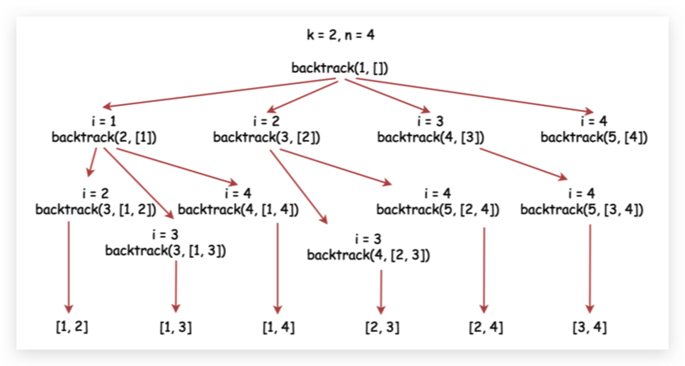

# 77. 组合 Combinations

## Problem

[77. 组合](https://leetcode-cn.com/problems/combinations/)

## 思路

1. 回溯算法，从起始位置开始循环所有小于 n 的数字。
2. 递归调用回溯方法，起始位置加一。
3. 最后一步要从集合中移除最后一个元素，完成回溯。
4. 每次递归，判断组合数达到 k 就将其加入结果集。
5. 不太好理解，可以尝试写 main 方法 debug 调试。



## Code

```java
class Solution {
    List<List<Integer>> res = new LinkedList<>();

    public List<List<Integer>> combine(int n, int k) {
        if (n <= 0 || k <= 0 || n < k) return res;
        backtrack(n, k, 1, new LinkedList<>());
        return res;
    }

    private void backtrack(int n, int k, int start, LinkedList<Integer> curr) {
        // 组合数字到 k 就加入结果集，注意每次要 new LinkedList
        if (curr.size() == k) res.add(new LinkedList<>(curr));
        // i 的起始位置是 start，最外层为 1，递归时不断加 1，组合所有小于等于 n 的数字
        for (int i = start; i <= n; ++i) {
            curr.add(i);
            // 从下个数字开始下探
            backtrack(n, k, i + 1, curr);
            // 回溯，从递归出来移除最后一个元素，下次循环再尝试加入后续元素
            curr.removeLast();
        }
    }
}
```
