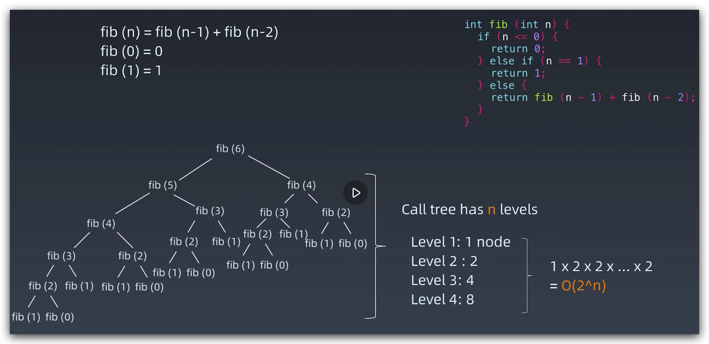
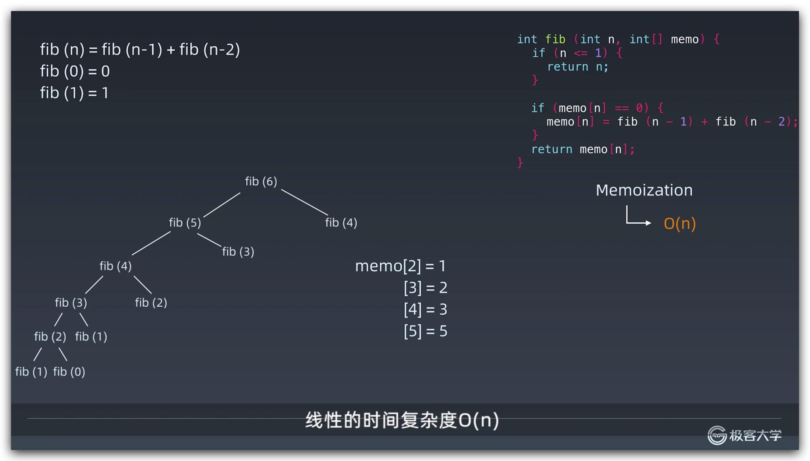
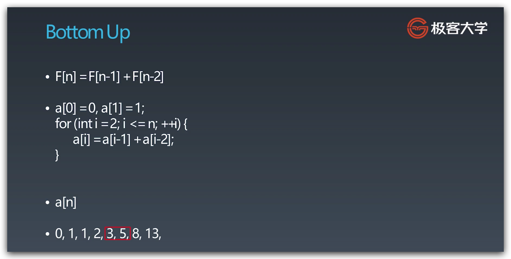
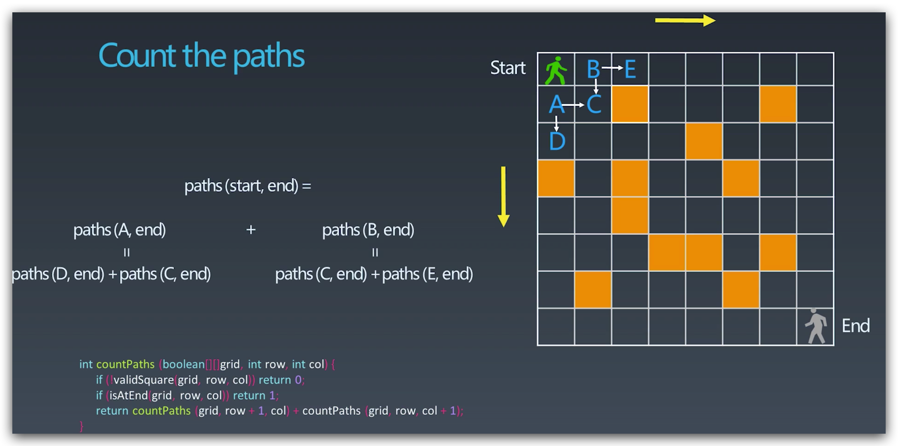
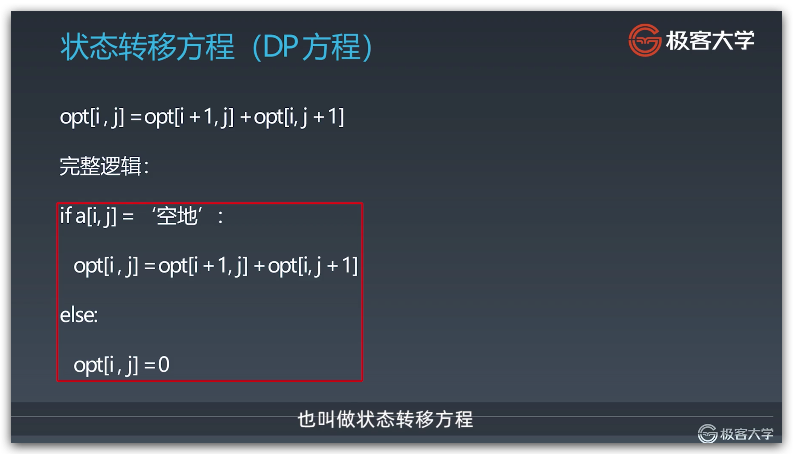
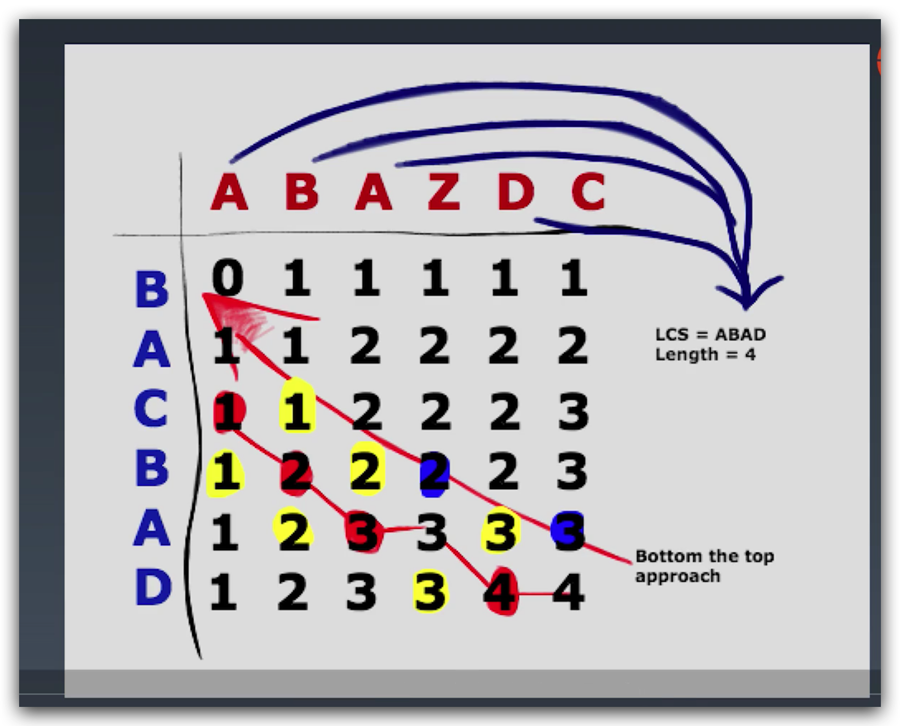
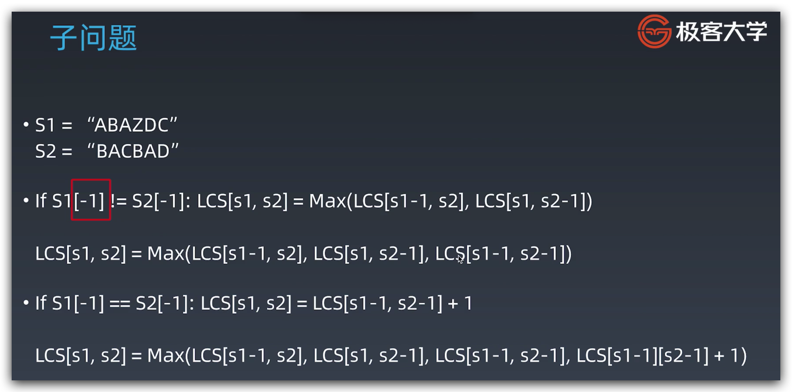
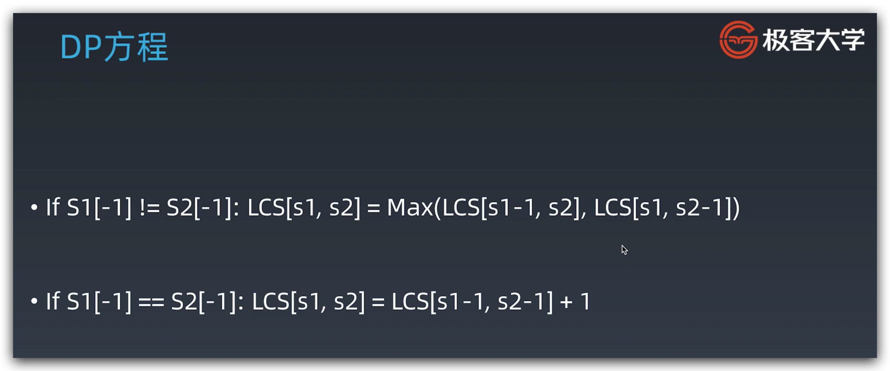

# 算法训练营 Lesson 12 动态规划

## 复习

### 递归 Recursive

1. 终止条件
2. 处理逻辑
3. 递归调用
4. 状态回溯

```python
# Python
def recursion(level, param1, param2, ...):
# recursion terminator
if level > MAX_LEVEL:
process_result
return

# process logic in current level
process(level, data...)

# drill down
self.recursion(level + 1, p1, ...)

# reverse the current level status if needed
```

```java
// Java
public void recur(int level, int param) {

  // terminator
  if (level > MAX_LEVEL) {
    // process result
    return;
  }

  // process current logic
  process(level, param);

  // drill down
  recur( level: level + 1, newParam);

  // restore current status

}
```

### 分治 Divide and Conquer

```python
# Python
def divide_conquer(problem, param1, param2, ...):
# recursion terminator
if problem is None:
print_result
return

# prepare data
data = prepare_data(problem)
subproblems = split_problem(problem, data)

# conquer subproblems
subresult1 = self.divide_conquer(subproblems[0], p1, ...)
subresult2 = self.divide_conquer(subproblems[1], p1, ...)
subresult3 = self.divide_conquer(subproblems[2], p1, ...)
…

# process and generate the final result
result = process_result(subresult1, subresult2, subresult3, …)

# revert the current level states
```

## Thinking

1. 避免人肉递归，但可以画状态树、递归树。
2. 找到最近最简方法，将其拆解为可重复解决问题。
3. 数学归纳法思维。

## 动态规划 Dynamic Programming

> simplifying a complicated problem by breaking it down into simpler sub-problems in a recursive manner
>
> [Dynamic programming - Wikipedia](https://en.wikipedia.org/wiki/Dynamic_programming)

```markdown
DP = Divide & Conquer + optimal substructure
```

### 异同点

1. DP 与递归或分治没有本质区别，**关键看有无最优子结构**。
2. 共性：找到重复子问题。
3. 差异：最优子结构，中途可以淘汰次优解，避免傻递归（naive recursive）和傻分治。

### 复杂情况

1. 维度上升。
2. 取舍最优子结构。

### 解题关键

1. 最优子结构 opt[n] = best_of(opt[n - 1], opt[n - 2],...)
2. 🟩 存储中间状态 opt[i]（一般开数组存，分支一般放在递归里，这里有明显区别）。
3. 🟥 递推公式（状态转移方程或 DP 方程)：
   * fib(n) = fib(n - 1)+ fi
   * opt[i, j] = opt[i + 1, j] + opt[i, j + 1] 且判断 opt[i, j] 是否是空地

### 解题步骤

1. 子问题
2. 状态定义
3. 状态转移方程

### Memorize DP Algorithm

* DP ≈ recursion + memorization
* memorize & re-use solutions  to subproblems that help solve the problem.

### Bottom-up DP Algorithm

## 参考资料

* [【MIT课程】动态规划 I - 最短路径算法](https://www.bilibili.com/video/av53233912?from=search&seid=2847395688604491997)

## 实战例题

### 斐波那契数列 Fibonacci Numbers

Top Down，指数级时间复杂度 O(2^n)，因为状态树每层都会乘以 2，n 层就是 2^n。



使用 memo 数组（Memorized DP Algorithm）记录每次计算的值，记忆化搜索，时间复杂度降为 O(n)。



Bottom Up 自底向上，适用于熟练后用于竞赛和面试等要求快速求解的场景，被认为是终极形态。



### 路径计数 Count the Paths

Top Down

子问题：从起点可以走到 A 或者走到 B，从 A 到终点的路径 + 从 B 到终点的路径。



自底向上



### 最长公共子序列 Longest Common Subsequence

状态定义：两个字符串构成表格，焦点就是两个子字符串的最长公共子序列数。



子问题：区分字符相同与不同两种情况：

1. 相同时，判断左上位置的 LCS，然后加一。
2. 不同时，取左和上两个位置中的最大 LCS 值。





