# 学习笔记

## 字典树 Trie

### 定义

字典树，即 Trie 树，又叫前缀树、单词查找树和键树，是多叉树结构，用于统计和排序字符串（但不限于字符串）。实际应用包括搜索引擎提供的搜索框输入联想提示，词频统计，IDE 的代码提示等等。

### 特点

1. 最大限度减少无谓的字符串比较，查询效率比哈希表高。
2. Trie 树是一种以空间换时间的数据结构，需要先构造多叉树，然后再查找，拥有 O(n) 的时间复杂度。
3. 其本质为利用字符串的公共前缀，合并前缀。

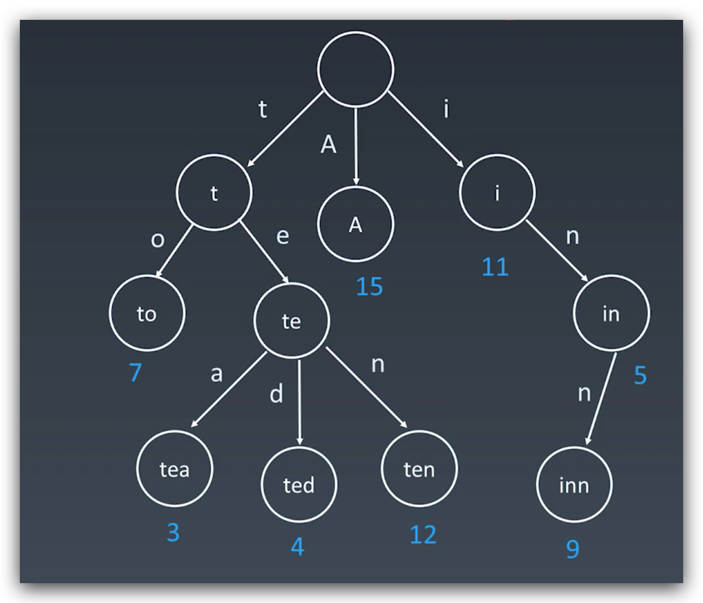

#### 🤔 为什么 Trie 树查询效率比哈希表高

> 其他的数据结构，如平衡树和哈希表，使我们能够在字符串数据集中搜索单词。为什么我们还需要 Trie 树呢？尽管哈希表可以在 O(1) 时间内寻找键值，却无法高效的完成以下操作：

* 找到具有同一前缀的全部键值。
* 按词典序枚举字符串的数据集。

> Trie 树优于哈希表的另一个理由是，随着哈希表大小增加，会出现大量的冲突，时间复杂度可能增加到 O(n)，其中 n 是插入的键的数量。与哈希表相比，Trie 树在存储多个具有相同前缀的键时可以使用较少的空间。此时 Trie 树只需要 O(m) 的时间复杂度，其中 m 为键长。而在平衡树中查找键值需要 O(m log n) 时间复杂度。

1. Trie 树存储字符，而哈希表存储字符串，空间效率上 Trie 树更高。
2. Trie 在按前缀搜索时可以很方便的查找其下一节点的所有字符串，而哈希表只能全表遍历，数据样本越大差距越明显。

#### 🤔 为什么 Trie 树根节点不存储数据

根节点其实是一个初始化的空 TrieNode 节点，表示一个空字符串的状态，并不匹配任何字符串。而其指向下一节点的路径（即 links 数组）才构成字符串前缀。所以说 Trie 树不存储数据，实际上是一种状态的表示。

### 实现形式

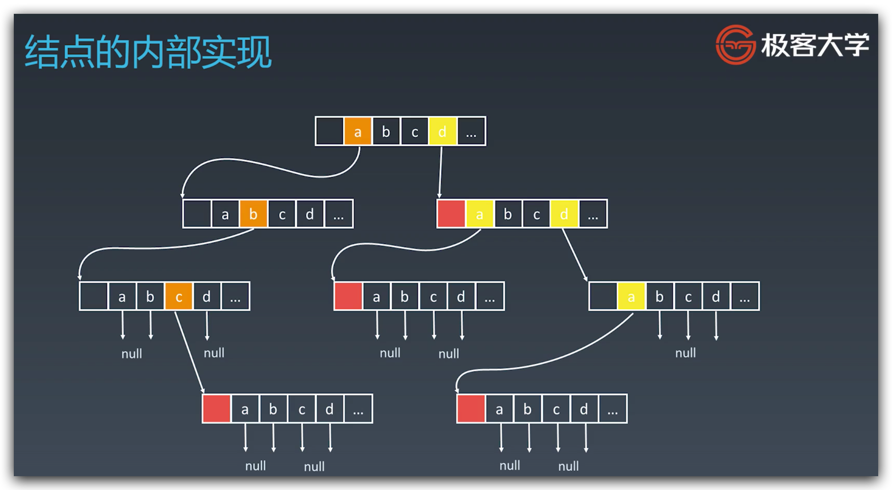

1. 根结点不存储完整单词。
2. 其余每个节点存储字符串的每个字符，从根节点到某一节点路径上字符连起来就是该节点对应的字符串。注意不是所有节点都有对应的值，只有叶子节点和部分内部节点所对应的键才有值。
3. 每个节点的所有子节点路径代表的字符都不相同。
4. 字符串终点不一定是叶子结点。
5. 每个节点存储一个子节点的数据结构（如数组）用于查找子节点（对于小写英文字母字符串可使用 ASCII 码与 a 的差值做数组下标，快速定位字符位置）。

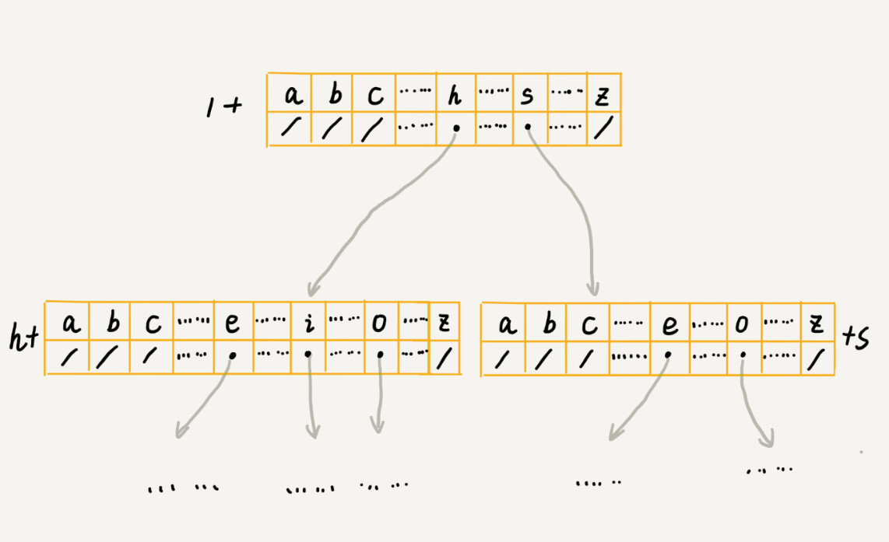

### 代码模板

```python
class Trie(object):

    def __init__(self):
        self.root = {}
        self.end_of_word = "#"

    def insert(self, word):
        node = self.root
        for char in word:
            node = node.setdefault(char, {})
        node[self.end_of_word] = self.end_of_word

    def search(self, word):
        node = self.root
        for char in word:
            if char not in node:
                return False
            node = node[char]
        return self.end_of_word in node

    def startsWith(self, prefix):
        node = self.root
        for char in prefix:
            if char not in node:
                return False
            node = node[char]
        return True
```

```java
class Trie {
    private boolean isEnd;
    private Trie[] next;

    /**
     * Initialize your data structure here.
     */
    public Trie() {
        isEnd = false;
        next = new Trie[26];
    }

    /**
     * Inserts a word into the trie.
     */
    public void insert(String word) {
        if (word == null || word.length() == 0) {
            return;
        }
        Trie curr = this;
        char[] words = word.toCharArray();
        for (int i = 0; i < words.length; i++) {
            int n = words[i] - 'a';
            if (curr.next[n] == null) {
                curr.next[n] = new Trie();
            }
            curr = curr.next[n];
        }
        curr.isEnd = true;
    }

    /**
     * Returns if the word is in the trie.
     */
    public boolean search(String word) {
        Trie node = searchPrefix(word);
        return node != null && node.isEnd;
    }

    /**
     * Returns if there is any word in the trie that starts with the given prefix.
     */
    public boolean startsWith(String prefix) {
        Trie node = searchPrefix(prefix);
        return node != null;
    }

    private Trie searchPrefix(String word) {
        Trie node = this;
        char[] words = word.toCharArray();
        for (int i = 0; i < words.length; i++) {
            node = node.next[words[i] - 'a'];
            if (node == null) {
                return null;
            }
        }
        return node;
    }
}
```

王铮版

```java
public class Trie {
    private TrieNode root = new TrieNode('/'); // 存储无意义字符

    // 往 Trie 树中插入一个字符串
    public void insert(char[] text) {
        TrieNode p = root;
        for (int i = 0; i < text.length; ++i) {
            int index = text[i] - 'a';
            if (p.children[index] == null) {
                TrieNode newNode = new TrieNode(text[i]);
                p.children[index] = newNode;
            }
            p = p.children[index];
        }
        p.isEndingChar = true;
    }

    // 在 Trie 树中查找一个字符串
    public boolean find(char[] pattern) {
        TrieNode p = root;
        for (int i = 0; i < pattern.length; ++i) {
            int index = pattern[i] - 'a';
            if (p.children[index] == null) {
                return false; // 不存在 pattern
            }
            p = p.children[index];
        }
        if (p.isEndingChar == false) {
            return false; // 不能完全匹配，只是前缀
        } else {
            return true; // 找到 pattern
        }
    }

    public class TrieNode {
        public char data;
        public TrieNode[] children = new TrieNode[26];
        public boolean isEndingChar = false;

        public TrieNode(char data) {
            this.data = data;
        }
    }
}
```

### 限制

1. 字符串中包含的字符集不能太大。
2. 要求字符串的前缀重合比较多，不然空间消耗会变大很多。
3. 如果要用 Trie 树解决问题，那我们就要自己从零开始实现一个 Trie 树，还要保证没有 bug，这个在工程上是将简单问题复杂化，除非必须，一般不建议这样做。
4. 通过指针串起来的数据块是不连续的，而 Trie 树中用到了指针，所以，对缓存并不友好，性能上会打个折扣。

### 实战题目

* [208. 实现 Trie (前缀树)](https://leetcode-cn.com/problems/implement-trie-prefix-tree/)
* [212. 单词搜索 II](https://leetcode-cn.com/problems/word-search-ii/)

## 并查集 Disjoint / Union Find

### 适用场景

* 组团、配对问题，使用并查集遍历一遍图中素有元素，就可以知道连通分量是多少。

### 基本操作

* `makeSet(s)`: 建立一个新的并查集，其中包含 s 个元素集合。
* `unionSet(x, y)`: 把元素 x 和元素 y 所在的集合合并，要求 x 和 y 所在集合不相交，如何相交则不合并。
* `find(x)`: 找到元素 x 所在集合的代表，该操作也可以用于判断两个元素是否位于同一个集合，只要将他们格子代表比较一下就可以了。

### 并查集代码模板

```java
class UnionFind {
    private int count = 0;
    private int[] parent;

    public UnionFind(int n) {
        count = n;
        parent = new int[n];
        for (int i = 0; i < n; i++) {
            parent[i] = i;
        }
    }

    public int find(int p) {
        while (p != parent[p]) {
            parent[p] = parent[parent[p]];
            p = parent[p];
        }
        return p;
    }

    public void union(int p, int q) {
        int rootP = find(p);
        int rootQ = find(q);
        if (rootP == rootQ) {
            return;
        }
        parent[rootP] = rootQ;
        count--;
    }
}
```

```python
def init(p):
    # for i = 0 .. n: p[i] = i;
    p = [i for i in range(n)]

def union(self, p, i, j):
    p1 = self.parent(p, i)
    p2 = self.parent(p, j)
    p[p1] = p2

def parent(self, p, i):
    root = i
    while p[root] != root:
        root = p[root]
    while p[i] != i: # 路径压缩 ?
        x = i; i = p[i]; p[x] = root
    return root
```

```java
 class UF {
    // 连通分量个数
    private int count;
    // 存储一棵树
    private int[] parent;
    // 记录树的“重量”
    private int[] size;

    public UF(int n) {
        this.count = n;
        parent = new int[n];
        size = new int[n];
        for (int i = 0; i < n; i++) {
            parent[i] = i;
            size[i] = 1;
        }
    }

    public void union(int p, int q) {
        int rootP = find(p);
        int rootQ = find(q);
        if (rootP == rootQ)
            return;

        // 小树接到大树下面，较平衡
        if (size[rootP] > size[rootQ]) {
            parent[rootQ] = rootP;
            size[rootP] += size[rootQ];
        } else {
            parent[rootP] = rootQ;
            size[rootQ] += size[rootP];
        }
        count--;
    }

    public boolean connected(int p, int q) {
        int rootP = find(p);
        int rootQ = find(q);
        return rootP == rootQ;
    }

    private int find(int x) {
        while (parent[x] != x) {
            // 进行路径压缩
            parent[x] = parent[parent[x]];
            x = parent[x];
        }
        return x;
    }

    public int count() {
        return count;
    }
}

作者：labuladong
链接：https://leetcode-cn.com/problems/friend-circles/solution/union-find-suan-fa-xiang-jie-by-labuladong/
来源：力扣（LeetCode）
著作权归作者所有。商业转载请联系作者获得授权，非商业转载请注明出处。
```

### 性能优化

#### 平衡性优化

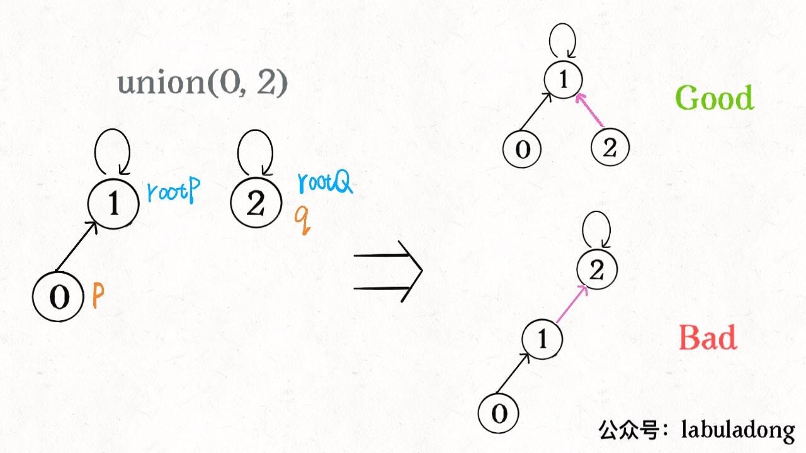

由于暴力合并可能因为树结构不平衡导致查询性能退化，所以应该在每次 union 时根据连通分量大小，用小树合并到大树，保持相对平衡，时时间复杂度降为 O(log n)。

#### 路径压缩

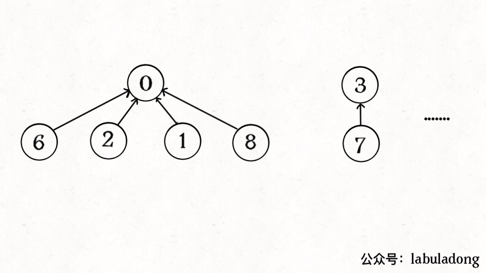

find 时可以通过将所有节点都连到根节点，缩短树高，达到压缩路径的目的，使查询效率降为 O(1)。

```java
private int find(int x) {
    while (parent[x] != x) {
        // 进行路径压缩，父节点赋值为爷爷节点
        parent[x] = parent[parent[x]];
        // 当前节点赋值为父节点，相当于向上找根
        x = parent[x];
    }
    return x;
}

作者：labuladong
链接：https://leetcode-cn.com/problems/friend-circles/solution/union-find-suan-fa-xiang-jie-by-labuladong/
来源：力扣（LeetCode）
著作权归作者所有。商业转载请联系作者获得授权，非商业转载请注明出处。
```

#### 并查集实战题目

* [547. 朋友圈](https://leetcode-cn.com/problems/friend-circles/)
* [200. 岛屿数量](https://leetcode-cn.com/problems/number-of-islands/)
* [130. 被围绕的区域](https://leetcode-cn.com/problems/surrounded-regions/)

## 红黑树和 AVL 树

### Balancing BST

* 2-3 tree
* AA tree
* AVL tree
* B-tree
* Red-black tree
* Scapegoat tree
* Splay tree
* Treap
* Weight-balanced tree

### AVL Tree

> The AVL tree is named after its two Soviet inventors, Georgy Adelson-Velsky and Evgenii Landis, who published it in their 1962 paper "An algorithm for the organization of information".

#### 平衡因子 Balance Factor

左子树高度减去右子树高度（有时相反）

balance factor = {-1, 0, 1}

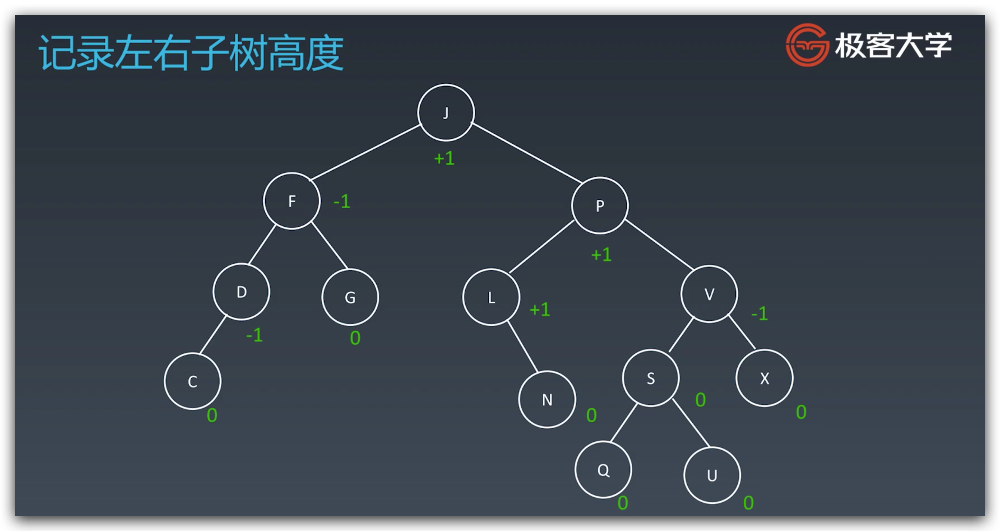

##### 旋转 Rotation

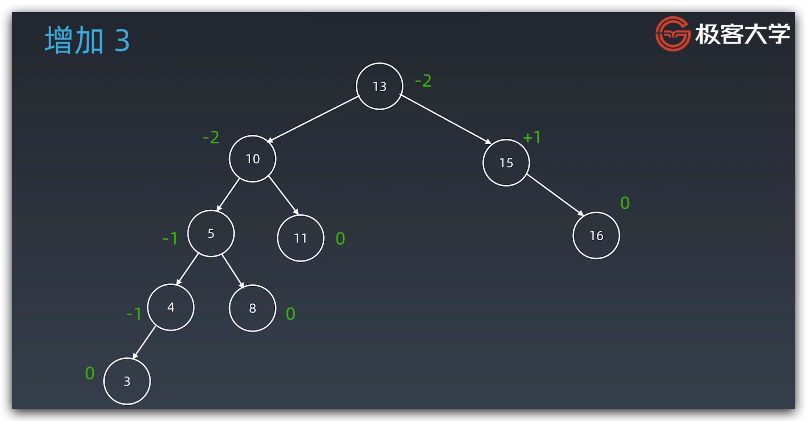

##### 左旋

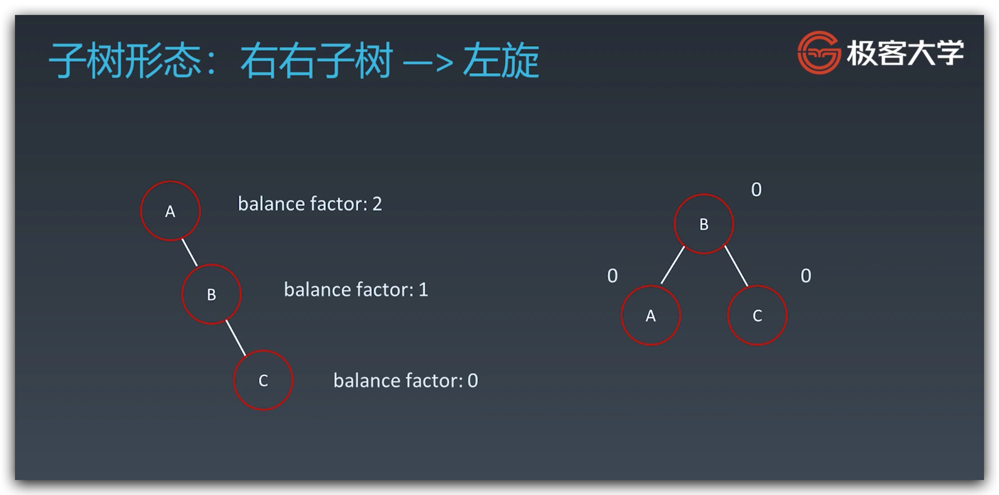

##### 右旋

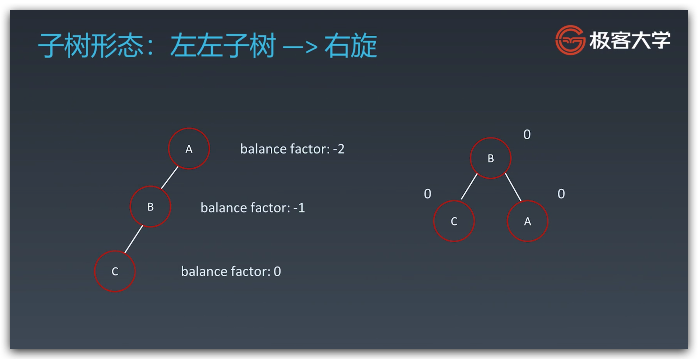

##### 左右旋

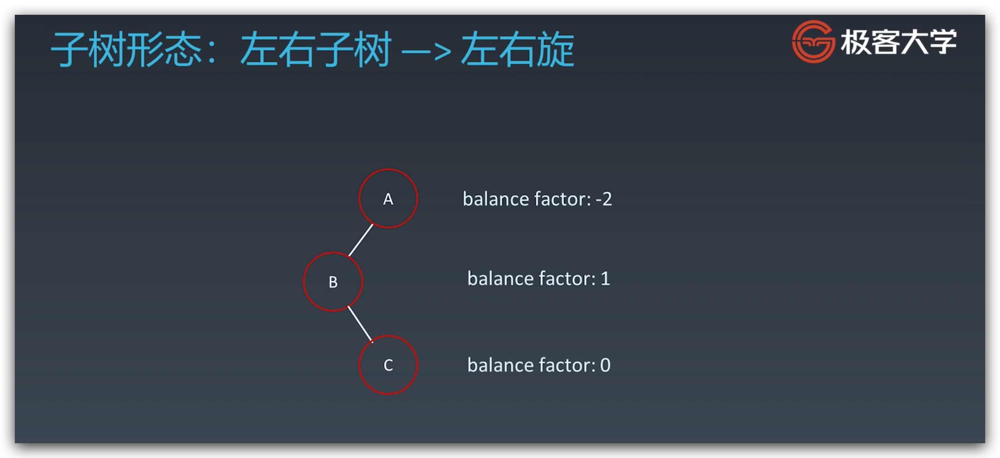

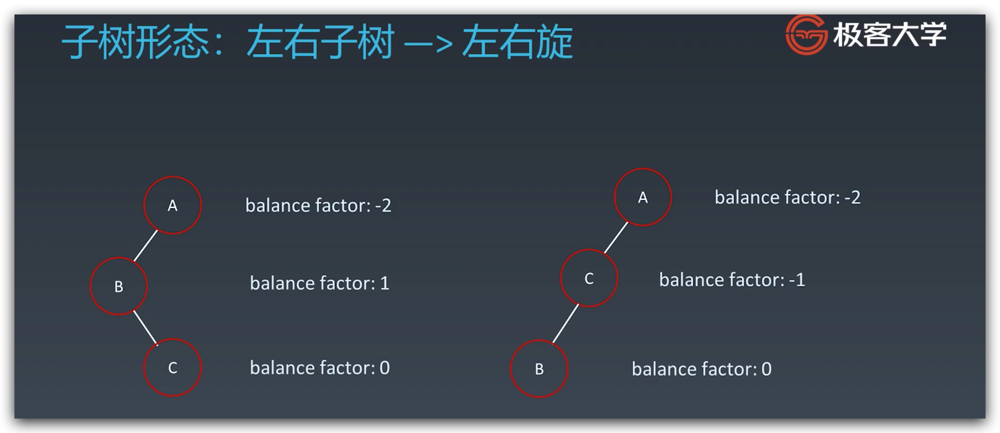

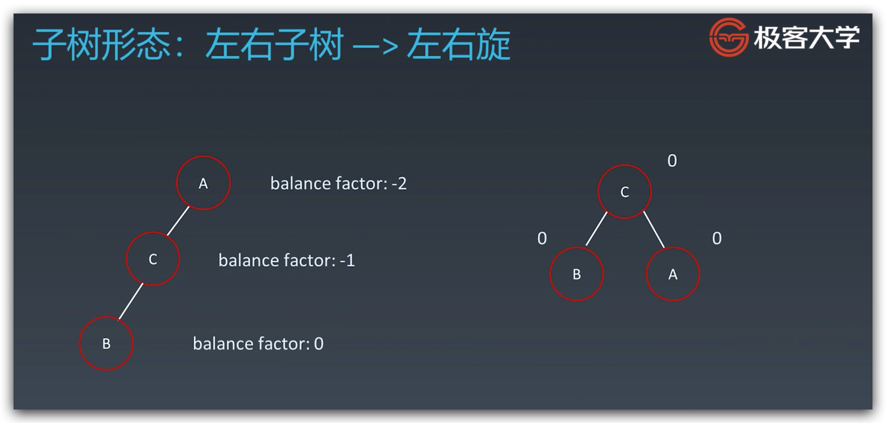

##### 右左旋

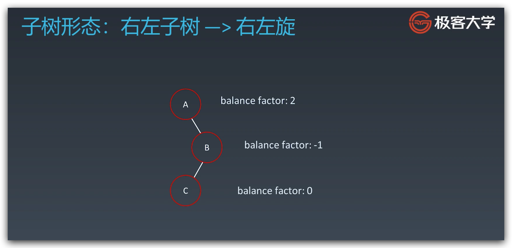

#### 缺点

* 结点需存储额外信息
* 调整次数频繁

### 红黑树 Red-black Tree

红黑树是一种**近似平衡**的二叉搜索树（BST），它能够确保任何一个结点的左右子树的高度差小于两倍。

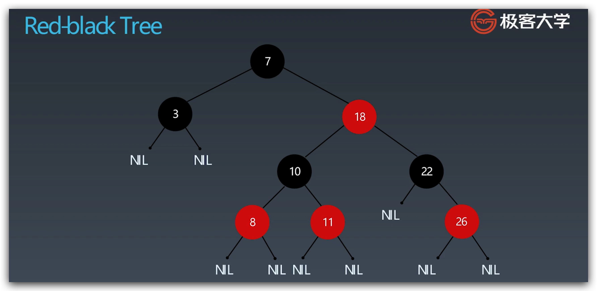

#### 性质

1. 每个结点要么是红色，要么是黑色。
2. 根节点是黑色。
3. 每个叶子结点（NIL 节点，空节点）是黑色的。
4. 不能有相邻的两个红色结点。
5. 从任意一结点到其每个叶子的所有路径都包含相同数目的黑色节点。

### AVL Tree vs Red-black Tree

* AVL Trees provides ::faster lookups:: than Red-black Trees because they are more strictly balanced.
* Red-black Trees provides ::faster insertion and removal:: operations than AVL Trees as fewer rotations are done due to relatively relaxed balancing.
* AVL Trees store balance ::factors  or heights:: with each node, thus requires storage for an integer per node whereas Red-black Trees requires only 1 bit of information  per node.
* Red-black Trees are used in most of  the ::language libraries like map, multi-map,  multi-set in C++:: whereas AVL Trees are used in ::databases:: where faster retrievals are required.

### Reference

* [极客大学-让优秀的人一起学习](https://u.geekbang.org/lesson/19?article=262606)
* [Trie - 维基百科，自由的百科全书](https://zh.wikipedia.org/wiki/Trie)
* [实现 Trie (前缀树) 官方理解 - 力扣](https://leetcode-cn.com/problems/implement-trie-prefix-tree/solution/shi-xian-trie-qian-zhui-shu-by-leetcode/)
* [Self-balancing binary search tree - Wikipedia](https://en.wikipedia.org/wiki/Self-balancing_binary_search_tree)
* [Union-Find 算法详解](https://leetcode-cn.com/problems/friend-circles/solution/union-find-suan-fa-xiang-jie-by-labuladong/)

