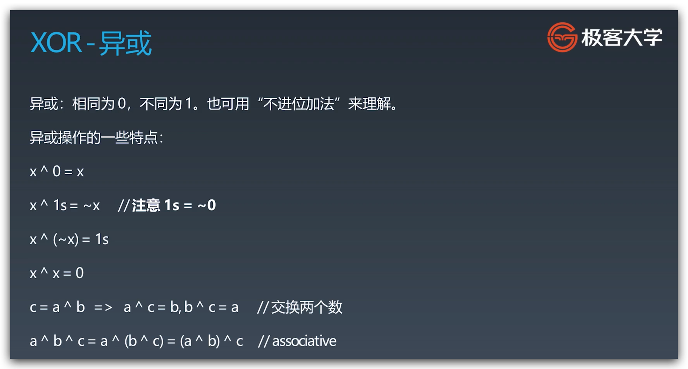
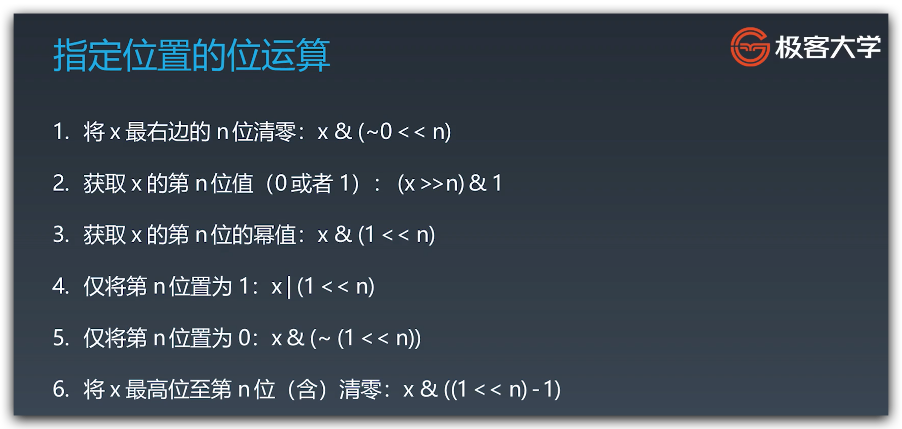
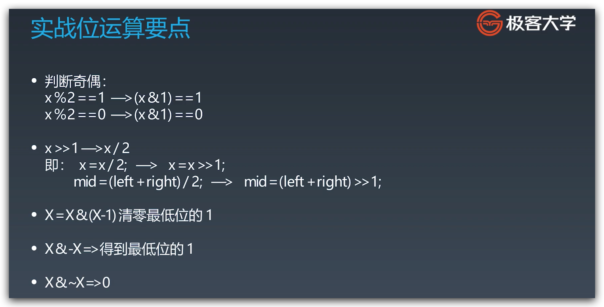
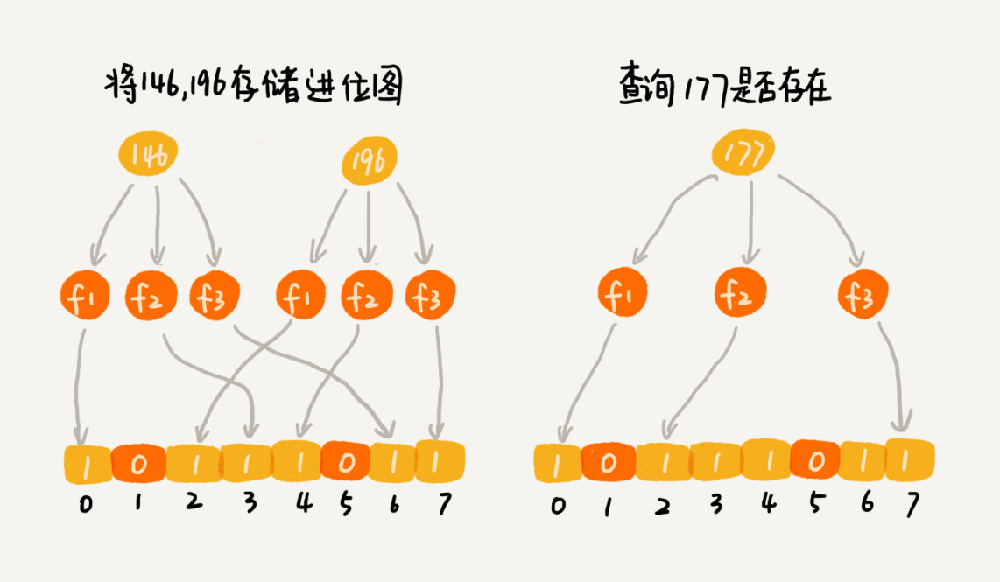
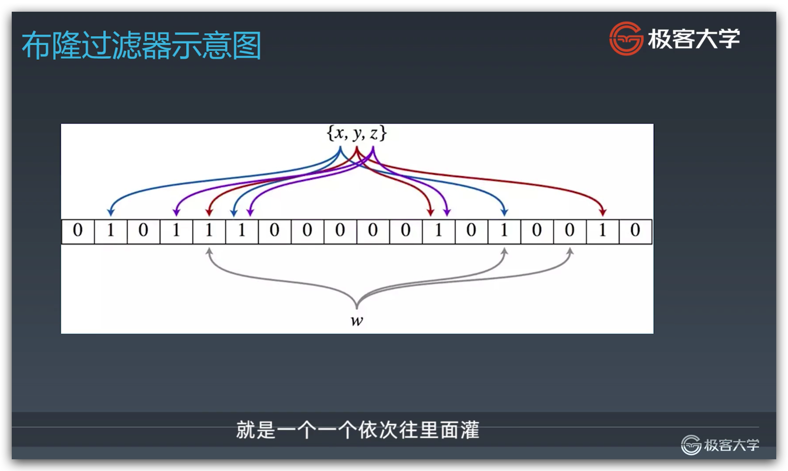
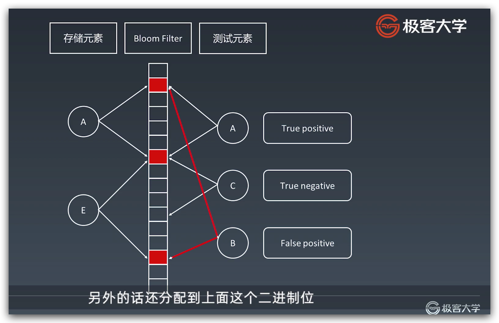
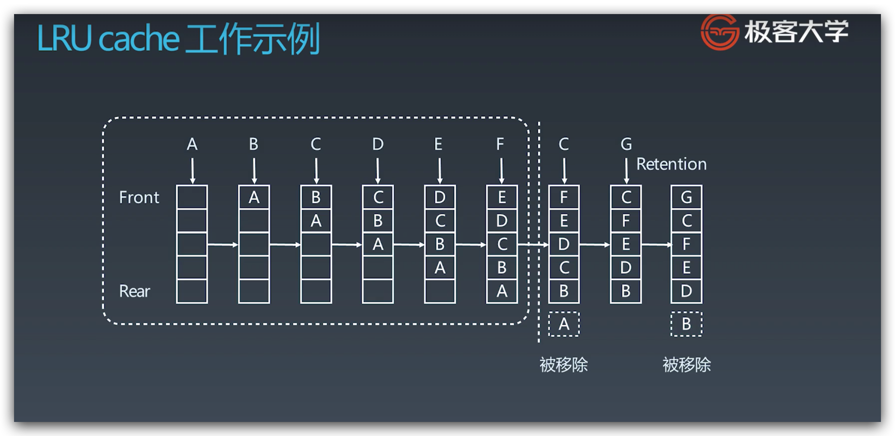

# 学习笔记

## 为什么需要位运算

* 计算机中数字表示和数据存储格式就是二进制。

[如何从十进制转换为二进制](https://zh.wikihow.com/%E4%BB%8E%E5%8D%81%E8%BF%9B%E5%88%B6%E8%BD%AC%E6%8D%A2%E4%B8%BA%E4%BA%8C%E8%BF%9B%E5%88%B6)

4(d): 0100
8(d): 01000
5(d): 0101
6(d): 0110

## 位运算符

* `>>` 算术右移，不带符号位，右移后最高位符号位不变，正数补 0，负数补 1
* `>>>` 逻辑右移，带符号位，右移后最高位补 0
* `<<`
* `|`
* `&`
* `~` 取反
* `^` 异或

### XOR 异或



* `x ^ 0 = x`
* `x ^ 1s = 1s  // 1s = ~0`
* `x ^ (~x) = 1s`
* `x ^ x = 0`
* `c = a ^ b => a ^ c = b, b ^ c = a  // 交换两个数`
* `a ^ b ^ c = a ^ (b ^ c) = (a ^ b) ^ c  // associative 结合法`

### 指定位置的位运算



* `x & (~0 << n)`
* `(x >> n) & 1`
* `x & (1 << n)`
* `x | (1 << n)`
* `x & (~(1 << n))`
* `x & ((1 << n) - 1)`

### 实战位运算要点



* `x % 2 == 1` -> `(x & 1) == 1`
* `x % 2 == 1` -> `(x & 1) == 0`
* `x / 2` -> `x >> 1`
* `x = x & (x - 1)  // 清零最低位 1`
* `x & -x  // 保留最低位 1，并将其余位置清零`
* `x & ~x  // 0`

## 位图 BitMap

使用二进制位表示字符或数字是否存在，通过数组方式存储，存取时使用位运算，效率高。但对于大数据量（比如十亿数据需要 120MB 内存）对内存的占用就比较大了，改进方案就是布隆过滤器。

## 布隆过滤器 Bloom Filter

* 布隆过滤器是基于位图，使用 K 个哈希函数，降低散列冲突的过滤方式。
* 布隆过滤器是一个很长的二进制向量和一些列随机映射函数。可以用于检索一个元素是否在一个集合中。

### Bloom Filter VS Hash Table

哈希表不止可以判断数据存在性，还可以存储数据，而布隆过滤器只能判断存在性。

### 优缺点

* 优点是空间效率和查询时间都远远超过一般算法。
* 缺点是有一定误判率和删除困难。



* 如果某个数字经过布隆过滤器判断不存在，那说明这个数字真的不存在，不会发生误判。
* 如果某个数字经过布隆过滤器判断存在，这个时候才会有可能误判，有可能并不存在。
* 只要调整哈希函数的个数、位图大小跟要存储数字的个数之间的比例，可以将误判概率降到非常低。
* 误判将会导致某些本来不重复的数据被判为重复。



* x 由蓝色的三个二进制位表示
* y 由红色的三个二进制位表示
* z 由紫色的三个二进制位表示
* w 由灰色的三个二进制位表示，但有一个位是 0，说明 w 肯定不存在



* 测试元素 B，可能会因为散列冲突导致被误判为存在。

## 应用

* 海量数据去重
* 比特币网络用于过滤 transaction 是否在 node 中
* 分布式系统（Map-Reduce）Hadoop、search engine
* Redis 缓存
* 垃圾邮件、评论等过滤

### Bloom Filter 代码模板

```java
public class BloomFilter {
    private static final int DEFAULT_SIZE = 2 << 24;
    private static final int[] seeds = new int[] { 5, 7, 11, 13, 31, 37, 61 };
    private BitSet bits = new BitSet(DEFAULT_SIZE);
    private SimpleHash[] func = new SimpleHash[seeds.length];

    public BloomFilter() {
        for (int i = 0; i < seeds.length; i++) {
            func[i] = new SimpleHash(DEFAULT_SIZE, seeds[i]);
        }
    }

    public void add(String value) {
        for (SimpleHash f : func) {
            bits.set(f.hash(value), true);
        }
    }

    public boolean contains(String value) {
        if (value == null) {
            return false;
        }
        boolean ret = true;
        for (SimpleHash f : func) {
            ret = ret && bits.get(f.hash(value));
        }
        return ret;
    }

    // 内部类，simpleHash
    public static class SimpleHash {
        private int cap;
        private int seed;

        public SimpleHash(int cap, int seed) {
            this.cap = cap;
            this.seed = seed;
        }

        public int hash(String value) {
            int result = 0;
            int len = value.length();
            for (int i = 0; i < len; i++) {
                result = seed * result + value.charAt(i);
            }
            return (cap - 1) & result;
        }
    }
}
```

## LRU Cache

### 两个要素

1. 大小，缓存足够大全都保存就好，不需要淘汰。
2. 替换策略，Least Recently Used 最近最少使用。

### 实现方案

Hash Table + Doubly Linked List

### 时间复杂度

* 查询：O(1)
* 修改更新：O(1)

### LRU Cache 工作示例



## 替换策略

* LFU - least frequently used
* LRU - least recently used

## 实战例题

[146. LRU缓存机制](https://leetcode-cn.com/problems/lru-cache/)

## Reference

* [使用 BloomFilter 布隆过滤器解决缓存击穿、垃圾邮件识别、集合判重](https://blog.csdn.net/tianyaleixiaowu/article/details/74721877)
* [布隆过滤器(Bloom Filter)的原理和实现](https://www.cnblogs.com/cpselvis/p/6265825.html)
* [Bloom Filters - Introduction and Python Implementation](https://www.geeksforgeeks.org/bloom-filters-introduction-and-python-implementation/)
* [高性能布隆过滤器实现](https://github.com/jhgg/pybloof)
* [布隆过滤器 Java 实现示例 1](https://github.com/lovasoa/bloomfilter/blob/master/src/main/java/BloomFilter.java)
* [布隆过滤器 Java 实现示例 2](https://github.com/Baqend/Orestes-Bloomfilter)
* [Understanding the Meltdown exploit – in my own simple words  |](https://www.sqlpassion.at/archive/2018/01/06/understanding-the-meltdown-exploit-in-my-own-simple-words/)
* [LRU Cache Python 代码示例](https://shimo.im/docs/CoyPAyXooGcDuLQo)
* [替换算法总揽](https://en.wikipedia.org/wiki/Cache_replacement_policies)
