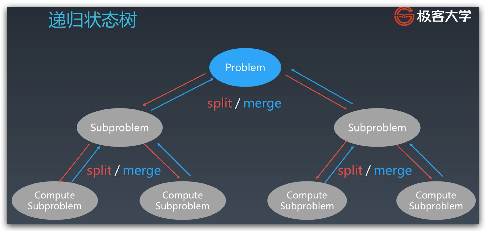

# 学习笔记

## 递归、分治、回溯、动态规划复习

### 递归

1. 终止条件。
2. 处理逻辑。
3. 调用自己。
4. 保存状态。

```java
public void recur(int level, int params) {
    // Teminator
    if (level > MAX_LEVEL) {
        // process result
    }
    // Process logic
    process(level, params);
    // Drill Down
    recur(level + 1, newParams);
    // Restore current status
}
```

### 分治

1. 分解子问题。
2. 处理子问题。
3. 合并子问题。

```java
public void divideAndConquer(int problem, String... params) {
    // Terminator
    if (problem == null) {
        print(result);
        return;
    }
    // Prepare data
    data = prepareDate(problem);
    subProblem = split_problem(problem, data);
    // Conquer subproblems
    subResult1 = divideAndConquer(subProblem[0], p1, ...);
    subResult2 = divideAndConquer(subProblem[1], p2, ...);
    subResult3 = divideAndConquer(subProblem[2], p3, ...);
    ...
    // Process and generate the final result
    result = process_result(subResult1, subResult2, subResult3....);
    // Revert the current level states
}
```



### 动态规划

1. 分治 + 最优子结构。
2. 动态递推。

```java
public void dp() {
    int[][] dp = new int[m][n];
    for (int i = 0; i < m; ++i) {
        for (int j = 0; j < n; ++j) {
            dp[i][j] = .....; // 状态转移方程
        }
    }
    return dp[m][n];
}
```

### 递归、分治 VS DP

共性：找重复子问题。
差异：最优子结构、中途淘汰次优解。

### 实战例题

#### 爬楼梯

递归 O(2^n)。

```java
public int climbStairs(int n) {
    if (n <= 2) {
        return n;
    } else {
        return climbStairs(n - 1) + climbStairs(n - 2);
    }
}
```


使用记忆化数组存储避免计算 O(n)。

```java
public int climbStairs(int n) {
    int[] memo = new int[n + 1];
    if (n <= 2) {
        return n;
    }
    if (memo[n] == 0) {
        memo[n] = climbStairs(n - 1) + climbStairs(n - 2);
    }
    return memo[n];
}
```

递推 O(n)。

```java
public int climbStairs(int n) {
    int[] dp = new int[n + 1];
    if (n <= 2) {
        return n;
    }
    for (int i = 0; i <= n; ++i) {
        if (i <= 2) {
            dp[i] = i;
        } else {
            dp[i] = dp[i - 1] + dp[i - 2];
        }
    }
    return dp[n];
}
```

递推空间优化 O(n) O(1)。

```java
public int climbStairs(int n) {
    int f1 = 1, f2 = 2, f3 = 3;
    if (n <= 2) {
        return n;
    }
    for (int i = 3; i < n; ++i) {
        f1 = f2;
        f2 = f3;
        f3 = f1 + f2;
    }
    return f3;
}
```

#### 不同路径

递归 O(m^n)。

```java
public int uniquePaths(int m, int n) {
    if (m <= 0 || n <= 0) {
        return 0;
    }
    if (m == 1 && n == 1) {
        return 1;
    }
    return uniquePaths(m - 1, n) + uniquePaths(m, n - 1);
}
```

记忆化数组 O(mn)。

```java
public int uniquePaths(int m, int n) {
    if (m <= 0 || n <= 0) {
        return 0;
    }
    if (m == 1 && n == 1) {
        return 1;
    }
    int[][] memo = new int[m + 1][n + 1];
    if (memo[m][n] == 0) {
        memo[m][n] = uniquePaths(m - 1, n) + uniquePaths(m, n - 1);
    }
    return memo[m][n];
}
```

递推 O(mn）。

```java
public int uniquePaths(int m, int n) {
    if (m <= 0 || n <= 0) {
        return 0;
    }
    int[][] dp = new int[m + 1][n + 1];
    for (int i = 0; i <= m; ++i) {
        for (int j = 0; j <= n; ++j) {
            if (i == 0 || j == 0) {
                dp[i][j] = 1;
            } else {
                dp[i][j] = dp[i - 1][j] + dp[i][j - 1];
            }
        }
    }
    return dp[m - 1][n - 1];
}
```

#### 打家劫舍

* 状态定义：一维数组 dp[i] 表示到第 i 间房子偷的最大金额。
* DP 方程：`dp[i] = Math.max(dp[i - 1], dp[i - 2] + nums[i])`
* 可利用二维状态表示是否偷了，可能会更好理解，对更复杂的 DP 题是一个铺垫：
  * dp[i][0]：到第 i 间房子偷的最大金额，并且没偷第 i 间。
  * dp[i][1]：到第 i 间房子偷的最大金额，并且偷了第 i 间。
  * `dp[i][0] = Math.max(dp[i - 1][0], dp[i - 1][1])`
  * `dp[i][1] = dp[i - 1][0] + nums[i]`

```java
public int rob(int[] nums) {
    if (nums == null || nums.length == 0) {
        return 0;
    }
    int length = nums.length;
    int[] dp = new int[length];
    for (int i = 0; i < length; ++i) {
        if (i == 0) {
            dp[i] = nums[0];
        } else if (i == 1) {
            dp[i] = Math.max(nums[0], nums[1]);
        } else {
            dp[i] = Math.max(dp[i - 1], dp[i - 2] + nums[i]);
        }
    }
    return dp[length - 1];
}
```

## 作业：最小路径和 II 状态转移方程

* 状态定义：dp[i, j] 为 (i, j) 位置上最小路径和。
* DP 方程：`dp[i][j] = obstacleGrid[i][j] == 0 ? Math.min(dp[i - 1][j], dp[i][j - 1]) : 0`

